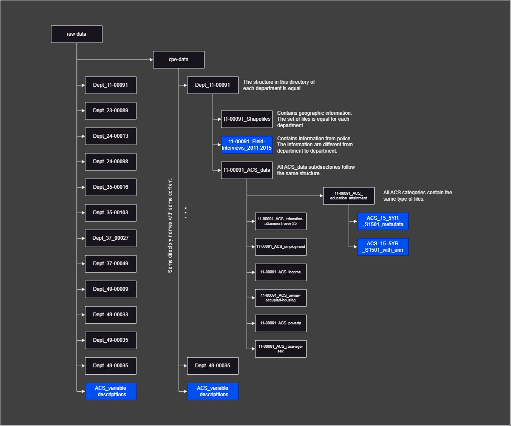

# Data Structure

The directories sometimes contain files or directories which are doubled. This will be ignored in belows description.

## Abbreviation

| Abbreviation | Translation | Source |
|--------------|-------------|--------|
| CPE | Center for Policing Equity | kaggle.com |
| ACS | American Community Survey | https://www.census.gov/programs-surveys/acs |
| HC | Housing Characteristics | https://www.census.gov/library/publications/1951/dec/hc-5.html
| UOF | Use of Force | https://policingequity.org/images/pdfs-doc/CPE_SoJ_Race-Arrests-UoF_2016-07-08-1130.pdf | 
| Dept | Department | |

## General Notes
Link to ACS: https://data.census.gov/

## Directory Structure

 
### raw_data (root directory)

- Contains directories for different departments and cpe-data.
- The directories in the cpe-data are the same departments with the same files inside.

### Departments (directories)
- The directories for each department follow the same structure and contain the same type of subdirectories / files.
- Contains directories for shapefiles and ACS data.
- Contains a CSV-file with the data from police.

### Shapefiles (subdirectory)
- Contain geo-data that can be explored with GIS-software.

### ACS Data (subdirectory)
- Contains directories with following categories:
    - education-attainment
    - education-attainment-over-25
    - employment
    - income
    - owner-occupied-housing
    - poverty
    - race-age-sex

## File Structures

### ACS_variable_description.csv (in root directory)
- Contains codes (variable names) and descriptions for each code.
- Example: HC01_VC80: Estimate; RACE - Race alone or in combination...

### Police Data (each department directory)
- The strucutre of the police data files differs from department to department.
- The name of the file is different, while UOF is often contained in the filename, indicating the focus on "use of force".

- Feature analysis:
    - The files contain different features - in total there are 106 unique feature names.
    - The files use between 8 (Dept_49-00035) and 34 (Dept_11-00091) features.
    - There is only one feature that is used by all (INCIDENT_DATE). This feautre has different structures (e.g. with date and time, only date, separate feature for time).
    - 64 of the features are used by only one department.
    - Shared feature names do not necessarly have the same data structure (e.g. INCIDENT_UNIQUE_IDENTIFIER is shared 9 times, but only two use the same structure).
    - Two departments use two types of identifiers.
    - The location is stored in various different features, but included in all department reports (with different structure and details).
    - The correlation of feautre usage shows that the highest score is around 0.52 (Dept_24-00013 and Dept_49-00033).
        - From the 13 features used by Dept_24-00013 4 are not used by Dept_49-00033.
        - From the 18 features used by Dept_49-00033 9 are not used by Dept_24-00013.
        - Only 9 features are used from both reports.
    - The correlation coefficients increase when the features are named in a standardized manner (e.g. the unique incident identifier has different feature names).
    - The correlation coefficients decrease when considering same naming, but different content.

Comparison between different reports are not usuable. Summarizing values such as total number of crimes can be used and compared along with the results from the ACS reports (see below).

### ACS_(x)_metadata.csv (each subdirectory in ACS data)
Execute metadata.py

- The metadata per category of each group are equally named for each department.
- Example: All metadata files from the different departments in the education-attainment directory have the same name: ACS_15_5YR_S1501_metadata.
- The metadata files contain two columns:
    - Code (e.g. HC01_EST_VC02)
    - Description (e.g. Total; Estimate; Population 18 to 24 years)
- The length of the unique value dictionary is different for each feature.
    - Code: 1289 unique entries
    - Description: 2053
    - The different metadata files use the same code for different content. The code is thus not a unique identifier.
    - Example: Code HC01_EST_VC03 -> in 'education-attainment' with the description: Total; Estimate; AGE - 16 to 19 years while in 'employment' described as Total; Estimate; Population 18 to 24 years - Less than high school graduate
- Each group (e.g education-attainment) has the same codes and descriptions over all departments. Meaning that the education-attainment group is equal over all departments.

### ACS_(x)_with_ann.csv (each ACS data directory)
- Contains the variables from metadata (e.g. Code HC01_EST_VC02) as features (columns)
- The annotation files are of differnet length (number of data points) for each department.
- The annotation files are of the same length (number of data points) within each group/category in one department.
