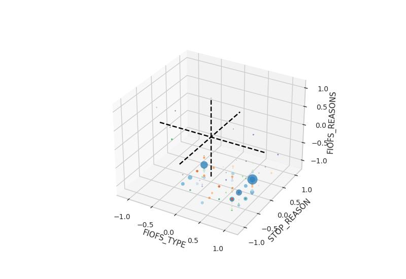

# 11-00091_Field-Interviews_2011-2016.csv

## 2.1 Data Exploration

### General Information
Location: Bosten    \
FIO: Field Interrogation and Observation (see [BPD](https://data.boston.gov/dataset/boston-police-department-fio)) \
Column descriptions can be found at [Data Boston](https://data.boston.gov/dataset/boston-police-department-fio/resource/1e5f1bc5-a0b4-4dce-ae1c-7c01ab3364f6?inner_span=True) \
The [file](/data_exploration/fiofielddescriptions.xlsx) contains the subtitle and the description.   \
The description incl. the title are listed in belows table:

| Title                                         | Subtitle              | Description                                                                                               |
| ----------------------------------------------| ----------------------| ----------------------------------------------------------------------------------------------------------|
| INCIDENT_UNIQUE_IDENTIFIER                    | SEQ_NUM               | Unique ID generated by database                                                                           |
| INCIDENT_UNIQUE_IDENTIFIER.1                  | FIO_ID                | Unique identifier for the FIO                                                                             |
| SUBJECT_GENDER                                | SEX                   | Sex of the person FIO'd                                                                                   |
| LOCATION_FULL_STREET_ADDRESS_OR_INTERSECTION  | LOCATION              | Street address where the stop occurred                                                                    |
| LOCATION_DISTRICT                             | DIST                  | District  in which the stop took place                                                                    |
| LOCATION_DISTRICT.1                           | DIST_ID               | Unique ID for the district used in the DIST field                                                         |
| INCIDENT_DATE                                 | FIO_DATE              | Date on which the stop occurred                                                                           |
| INCIDENT_TIME                                 | FIO_TIME              | Time at which the stop occurrend                                                                          |
| SUBJECT_DETAILS                               | PRIORS                | Does the perion being stopped have a prior record                                                         |
| SUBJECT_RACE                                  | DESCRIPTION           | **Identical to the RACE_DESC field**                                                                      |
| SUBJECT_DETAILS.1                             | CLOTHING              | Clothing worn by the person being stopped                                                                 |
| SUBJECT_DETAILS.2                             | COMPLEXION            | Complextion of the person being stopped                                                                   |
| UNKNOWN_FIELD_TYPE                            | FIOFS_TYPE            | Flag indicating what actions where taken during the FIO:  I=Interogated, O=Observed, F=Frisked, S=Search  |
| UNKNOWN_FIELD_TYPE                            | TERRORISM             | Terrorism related stop (Yes/No)                                                                           |
| SEARCH_CONDUCTED                              | SEARCH                | Flag indicating what was searched: V=Vehicle, P=Person                                                    |
| SEARCH_REASON                                 | BASIS                 | Basis for the stop:  Probable Cause, Reasonable Suspicion, or Content Search                              |
| INCIDENT_REASON                               | STOP_REASONS          | Reasons for original stop                                                                                 |
| INCIDENT_REASON.1                             | FIOFS_REASONS         | Reasons for Interogation, Observation, Frisk or Search                                                    |
| DISPOSITION                                   | OUTCOME               | Outcome:  S=Seizure, F=FIO, O=Other                                                                       |
| VEHICLE_MAKE                                  | VEH_MAKE              | Vehicle make                                                                                              |
| VEHICLE_YEAR                                  | VEH_YEAR_NUM          | Vehicle year                                                                                              |
| VEHICLE_COLOR                                 | VEH_COLOR             | Vehicle color                                                                                             |
| VEHICLE_MODEL                                 | VEH_MODEL             | Vehicle model                                                                                             |
| VEHICLE_DETAILS                               | VEH_OCCUPANT          | Vehicle passenger or driver                                                                               |
| VEHICLE_DETAILS.1                             | VEH_STATE             | Vehicle registration state                                                                                |
| OFFICER_SUPERVISOR                            | SUPERVISOR_ID         | Employee ID of the officer's supervisor                                                                   |
| OFFICER_ID                                    | OFFICER_ID            | Employee ID of the officer                                                                                |
| OFFICER_ASSIGNMENT                            | OFF_DIST_ID           | ID of the officer's district                                                                              |
| OFFICER_ASSIGNMENT.1                          | OFF_DIST              | Officer's district                                                                                        |
| OFFICER_ETHNICITY                             | ETHNICITY             | Ethnicity of the person stopped                                                                           |
| OFFICER_RACE                                  | RACE_DESC             | Description of the race of the person stopped                                                             |
| OFFICER_AGE                                   | AGE_AT_FIO_CORRECTED  | **Field added by the BRIC to store the age of the person at the time of the stop, based on the Date of birth given (not provided in data) and the corrected FIO_DATE** |
| LOCATION_STREET_NUMBER                        | STREET_ID             | Unique ID for the street used in the location field                                                       |
| LOCATION_CITY                                 | CITY                  | City (neighborhood) in which the stop occurred                                                            |

In comparison to the original source from the BPD following features / columns are missing:
- ENTEREDBY: id
- SUPERVISOR: name
- OFFICER: name
- SUP_ENTRYDATE: date & time
- LAST_UPDATEBY: id
- LAST_UPDATETIME: date & time
- FIRST_INSERTTIME: date & time
- ACTIVE_ID: always 1
- RACE_ID: id
- FIO_DATE_CORRECTED: date & time

According to the description the columns ('SUBJECT_RACE', 'DESCRIPTION') and ('OFFICER_RACE', 'RACE_DESC') are the same and both describe the race of subject, not the officer. \
According to the description the column ('OFFICER_AGE', 'AGE_AT_FIO_CORRECTED') contains the subject's age, not the age of the officer.

### Dataset Information
Numerical feature: quantitative feature
Ordinal feature: feature with a meaningful order
Nominal feature: feature without any order

RangeIndex: 152230 entries, 0 to 152229     \
Data columns (total 34 columns):            \

| #   | Feature                                                    | Non-Null Count | Dtype   | Feature category |
|-----|------------------------------------------------------------|----------------|---------|------------------|
| 0   | (INCIDENT_UNIQUE_IDENTIFIER, SEQ_NUM)                      | 149809         | int64   | nominal          |
| 1   | (INCIDENT_UNIQUE_IDENTIFIER.1, FIO_ID)                     | 149809         | int64   | nominal          |
| 2   | (SUBJECT_GENDER, SEX)                                      | 149809         | object  | nominal          |
| 3   | (LOCATION_FULL_STREET_ADDRESS_OR_INTERSECTION, LOCATION)   | 149807         | object  | nominal          |
| 4   | (LOCATION_DISTRICT, DIST)                                  | 149809         | object  | nominal          |
| 5   | (LOCATION_DISTRICT.1, DIST_ID)                             | 149809         | int64   | nominal          |
| 6   | (INCIDENT_DATE, FIO_DATE)                                  | 149809         | object  | ordinal          |
| 7   | (INCIDENT_TIME, FIO_TIME)                                  | 152230         | object  | ordinal          |
| 8   | (SUBJECT_DETAILS, PRIORS)                                  | 129251         | object  | nominal          |
| 9   | (SUBJECT_RACE, DESCRIPTION)                                | 149809         | object  | nominal          |
| 10  | (SUBJECT_DETAILS.1, CLOTHING)                              | 136603         | object  | nominal          |
| 11  | (SUBJECT_DETAILS.2, COMPLEXION)                            | 149809         | object  | nominal          |
| 12  | (UNKNOWN_FIELD_TYPE, FIOFS_TYPE)                           | 149809         | object  | nominal          |
| 13  | (UNKNOWN_FIELD_TYPE, TERRORISM)                            | 149809         | object  | nominal          |
| 14  | (SEARCH_CONDUCTED, SEARCH)                                 | 20344          | object  | nominal          |
| 15  | (SEARCH_REASON, BASIS)                                     | 34976          | object  | nominal          |
| 16  | (INCIDENT_REASON, STOP_REASONS)                            | 103566         | object  | nominal          |
| 17  | (INCIDENT_REASON.1, FIOFS_REASONS)                         | 149809         | object  | nominal          |
| 18  | (DISPOSITION, OUTCOME)                                     | 141042         | object  | nominal          |
| 19  | (VEHICLE_MAKE, VEH_MAKE)                                   | 139573         | object  | nominal          |
| 20  | (VEHICLE_YEAR, VEH_YEAR_NUM)                               | 149628         | float64 | numerical        |
| 21  | (VEHICLE_COLOR, VEH_COLOR)                                 | 139188         | object  | nominal          |
| 22  | (VEHICLE_MODEL, VEH_MODEL)                                 | 38354          | object  | nominal          |
| 23  | (VEHICLE_DETAILS, VEH_OCCUPANT)                            | 39360          | object  | nominal          |
| 24  | (VEHICLE_DETAILS.1, VEH_STATE)                             | 149809         | object  | nominal          |
| 25  | (OFFICER_SUPERVISOR, SUPERVISOR_ID)                        | 133702         | float64 | nominal          |
| 26  | (OFFICER_ID, OFFICER_ID)                                   | 149809         | int64   | nominal          |
| 27  | (OFFICER_ASSIGNMENT, OFF_DIST_ID)                          | 149809         | int64   | nominal          |
| 28  | (OFFICER_ASSIGNMENT.1, OFF_DIST)                           | 149809         | object  | nominal          |
| 29  | (OFFICER_ETHNICITY, ETHNICITY)                             | 23772          | object  | nominal          |
| 30  | (OFFICER_RACE, RACE_DESC)                                  | 152230         | object  | nominal          |
| 31  | (OFFICER_AGE, AGE_AT_FIO_CORRECTED)                        | 149809         | int64   | numerical        |
| 32  | (LOCATION_STREET_NUMBER, STREET_ID)                        | 149809         | int64   | nominal          |
| 33  | (LOCATION_CITY, CITY)                                      | 149809         | object  | nominal          |

dtypes: float64(2), int64(7), object(25) \
memory usage: 39.5+ MB

### Pre-Filtering of data points and features

Identical feature pairs:
('INCIDENT_DATE', 'FIO_DATE') & ('INCIDENT_TIME', 'FIO_TIME')    \
('SUBJECT_RACE', 'DESCRIPTION') &  ('OFFICER_RACE', 'RACE_DESC')

The second feature of each pair (FIO_TIME and RACE_DESC) will be removed from the dataset.

Removing duplicated data points:
Data points are checked for duplicants, ignoring the unique identifier features, since it can be assumed that they are auto-generated by the system.
2,421 data points are duplicants. All duplicants where removed from the dataset.

Remaining data points: 149,809.

## 2.2 Data Cleaning

List of unique values incl. common placeholders for n/a values. \
In () values are not for sure placeholders. \

| #   | Feature                                                    | Non-Null Count | Unique_Values  | n/a placeholder  | Needs processing          | Suspected correlation |
|-----|------------------------------------------------------------|----------------|----------------|------------------|---------------------------|-----------------------|
| 0   | (INCIDENT_UNIQUE_IDENTIFIER, SEQ_NUM)                      | 149809         | 149809         |                  | no                        | #1                    |
| 1   | (INCIDENT_UNIQUE_IDENTIFIER.1, FIO_ID)                     | 149809         | 149809         |                  | no                        | #0                    |
| 2   | (SUBJECT_GENDER, SEX)                                      | 149809         | 3              | (UNKOWN)         | RP                        |                       |
| 3   | (LOCATION_FULL_STREET_ADDRESS_OR_INTERSECTION, LOCATION)   | 149807         | 38360          | (UNKNOWN, OTHER) | STR. NO & INTERSEC        | #30                   | 
| 4   | (LOCATION_DISTRICT, DIST)                                  | 149809         | 24             |                  | no                        | #5 / #26 & #27        |
| 5   | (LOCATION_DISTRICT.1, DIST_ID)                             | 149809         | 24             |                  | no                        | #4 / #26 & #27        |
| 6   | (INCIDENT_DATE, FIO_DATE)                                  | 149809         | 2140           | Unplaus. dates   | RNP, remove hours         |                       |
| 7   | (SUBJECT_DETAILS, PRIORS)                                  | 129251         | 3              | (UNKNOWN)        | no                        |                       |
| 8   | (SUBJECT_RACE, DESCRIPTION)                                | 149809         | 8              | NO DATA ENTERED  | RP                        |                       |
| 9   | (SUBJECT_DETAILS.1, CLOTHING)                              | 136603         | 102127         | (UNKNOWN)        | Naming                    |                       |
| 10  | (SUBJECT_DETAILS.2, COMPLEXION)                            | 149809         | 10             | NO DATA ENTERED  | RP                        |                       |
| 11  | (UNKNOWN_FIELD_TYPE, FIOFS_TYPE)                           | 149809         | 26             |                  | separate in options       | #17                   |
| 12  | (UNKNOWN_FIELD_TYPE, TERRORISM)                            | 149809         | 2              |                  | no                        |                       |
| 13  | (SEARCH_CONDUCTED, SEARCH)                                 | 20344          | 3              |                  | no                        |                       |
| 14  | (SEARCH_REASON, BASIS)                                     | 34976          | 3              |                  | no                        |                       |
| 15  | (INCIDENT_REASON, STOP_REASONS)                            | 103566         | 6              |                  | no                        |                       |
| 16  | (INCIDENT_REASON.1, FIOFS_REASONS)                         | 149809         | 222            |                  | separate                  |                       |
| 17  | (DISPOSITION, OUTCOME)                                     | 141042         | 7              |                  | separate                  | #11                   |
| 18  | (VEHICLE_MAKE, VEH_MAKE)                                   | 139573         | 47             | (NO DATA ENTERED)| (RP)                      |                       |
| 19  | (VEHICLE_YEAR, VEH_YEAR_NUM)                               | 149628         | 51             | 0, Unplaus. dates| (RP)                      |                       |
| 20  | (VEHICLE_COLOR, VEH_COLOR)                                 | 139188         | 16             | (NO DATA ENTERED)| (RP)                      |                       |
| 21  | (VEHICLE_MODEL, VEH_MODEL)                                 | 38354          | 2006           |                  | Naming                    |                       |
| 22  | (VEHICLE_DETAILS, VEH_OCCUPANT)                            | 39360          | 2              |                  |                           |                       |
| 23  | (VEHICLE_DETAILS.1, VEH_STATE)                             | 149809         | 48             | (NO DATA ENTERED)|                           |                       |
| 24  | (OFFICER_SUPERVISOR, SUPERVISOR_ID)                        | 133702         | 219            | 1                | RP                        |                       |
| 25  | (OFFICER_ID, OFFICER_ID)                                   | 149809         | 1793           | (1)              |                           |                       |
| 26  | (OFFICER_ASSIGNMENT, OFF_DIST_ID)                          | 149809         | 26             |                  |                           | #27 / #4 & #5         |
| 27  | (OFFICER_ASSIGNMENT.1, OFF_DIST)                           | 149809         | 26             |                  |                           | #26 / #4 & #5         |
| 28  | (OFFICER_ETHNICITY, ETHNICITY)                             | 23772          | 1101           | non              | RP, Naming                |                       | 
| 29  | (OFFICER_AGE, AGE_AT_FIO_CORRECTED)                        | 149809         | 119            | Unplaus. dates   | RNP                       |                       |
| 30  | (LOCATION_STREET_NUMBER, STREET_ID)                        | 149809         | 3155           |                  |                           | #3                    |
| 31  | (LOCATION_CITY, CITY)                                      | 149809         | 23             | NO DATA ENTERED  | RP                        |                       |

RNP: Remove not plausible       \
RP: Replace Placeholder         \

### Features that are not cleaned:
(INCIDENT_UNIQUE_IDENTIFIER, SEQ_NUM)   \
(INCIDENT_UNIQUE_IDENTIFIER.1, FIO_ID)  \
(LOCATION_DISTRICT, DIST)               \
(LOCATION_DISTRICT.1, DIST_ID)          \
(SUBJECT_DETAILS, PRIORS)               \
(UNKNOWN_FIELD_TYPE, FIOFS_TYPE)        \
(UNKNOWN_FIELD_TYPE, TERRORISM)         \
(SEARCH_CONDUCTED, SEARCH)              \
(SEARCH_REASON, BASIS)                  \
(DISPOSITION, OUTCOME)                  \
(OFFICER_ASSIGNMENT, OFF_DIST_ID)       \
(OFFICER_ASSIGNMENT.1, OFF_DIST)        \
(LOCATION_STREET_NUMBER, STREET_ID)     \

### Processed features and doings:
- (SUBJECT_GENDER, SEX)
    - Replace UNKNWON with NA-value
    - The sex of a subject should be known. It can be assumed that the entry is missing.
- (LOCATION_FULL_STREET_ADDRESS_OR_INTERSECTION, LOCATION)
    - Remove street numbers from intersections
    - Some intersections have street numbers included, while others not. Since the intersection already contains an exact location, the numbers will be removed.
    - Sort intersections alphabetically
    - Some intersections are written as STREET_A at STREET_B or STREET_B at STREET_A. Since this is the same location, the intersection streets will be sorted alphabetically.
- (INCIDENT_DATE, FIO_DATE)
    - Remove time
    - All entries have a time stamp of 00:00. So this information will be removed to reduce the complexity.
    - Clear unplausible dates.
    - The report states the data from 2011 to 2015. All other dates will be replaced with pd.NA (and later imputed)
- (SUBJECT_RACE, DESCRIPTION)
    - Replace NO DATA ENTERED with NA-value
    - Removed all ()
    - The item "UNKNWON" was kept, since it is possible that some subjects could not be categorized.
- (SUBJECT_DETAILS.1, CLOTHING)
    - Transform all to upper cases
    - Adjust color names (BLK = BLACK, WHT = WHITE, GRY = GREY, BLU = BLUE, GRN = GREEN, BRN = BROWN, DRK = DARK, WHTE = WHITE)
    - Adjust clothing names (JCK = JKT = JACKET, SHT = SHIRT, SWTSHT = SWEATSHIRT, JNS = JEANS, HOODY = HOODIE)
    - Adjust naming for T-Shirt (T SHIRT = T-SHIRT, TSHIRT = T-SHIRT)
    - Remove "."
    - Replace "/" with ", "
    - The column remains difficult to evalute. Specific characteristics can be extracted, such as in general "BLACK" clothes. Refining the feature more or using it as it is right now, does not make sense.
- (SUBJECT_DETAILS.2, COMPLEXION)
    - Remove NO DATA ENTERED
- (OFFICER_SUPERVISOR, SUPERVISOR_ID) & (OFFICER_ID, OFFICER_ID)
    - Remove all "1"
    - Since all other IDs are much larger numbers, it can be assumed that the 1 and 2 stand for "UNKNOWN"/"MISSING DATA" etc.
- (OFFICER_AGE, AGE_AT_FIO_CORRECTED)
    - The age range lies in between -1 and 243. A threshold will be set between 10 and 80.
- (LOCATION_CITY, CITY)
    - Remove NO DATA ENTERED values
- (OFFICER_ETHNICITY, ETHNICITY)
    - Data is partwise not interpretable.
- (INCIDENT_REASON.1, FIOFS_REASONS)
    - Replace "INVESTIGATE" with "INVESTIGATION"
    - Only take first category of reason (before ,)
    - Grouping different categories
- (INCIDENT_REASON, STOP_REASONS)
    - Replaced OTHER (SPECIFY) with OTHER

### Vehicle related features
- The state is the only feature without missing entries (empty), but includes 99.456 NO DATA ENTERED and 10673 OTHER values.
- Some other vehicle related features show entries (e.g. "make" with 717 entries)
- The same applies for the other features, although occupant and model have no NO DATA ENTERED entries, but much more missing entries.
- As assumption:
    - Data points where all vehicle related features miss data (NO DATA ENTERED, 0, ""), including SEARCH not containing V or VP, no vehicle was involved. These fields will be filled with "NO VEHICLE INVOLVED".
    - Data points where at least one vehicle feature, will be counted as vehicle involved. Here the other missing features will be imputed later.
    - This assumption relates in 103273 entries where no vehicle was involved.
- VEH_MODEL receives further adjustments to the values.
    - Writting all in upper case and removing "." etc. reduced the unique values to around 1500.
    - The remaining differences are often based on a single entry (in the original unique entry list 90% of the values have less than 10 entries).
    - A further processing is not conducted for this project.

### Dropping data points
For dropping data points a threshold of 30% is set. All data points having less than 30% non-NaN values will be dropped.
This applies to 0 data points. 

New unique feature list:

| Feature                                       | Unique Value  | Delta |
|-----------------------------------------------|---------------|-------|
| INCIDENT_UNIQUE_IDENTIFIER                    | 149809        | 0     |
| INCIDENT_UNIQUE_IDENTIFIER.1                  | 149809        | 0     |
| SUBJECT_GENDER                                | 2             | -1    |
| LOCATION_FULL_STREET_ADDRESS_OR_INTERSECTION  | 33220         | -5140 |
| LOCATION_DISTRICT                             | 24            | 0     |
| LOCATION_DISTRICT.1                           | 24            | 0     |
| INCIDENT_DATE                                 | 1668          | -472  |
| SUBJECT_DETAILS                               | 3             | 0     |
| SUBJECT_RACE                                  | 7             | -1    |
| SUBJECT_DETAILS.1                             | 86107         | -16020|
| SUBJECT_DETAILS.2                             | 9             | -1    |
| UNKNOWN_FIELD_TYPE                            | 26            | 0     |
| UNKNOWN_FIELD_TYPE                            | 2             | 0     |
| SEARCH_CONDUCTED                              | 3             | 0     |
| SEARCH_REASON                                 | 3             | 0     |
| INCIDENT_REASON                               | 6             | 0     |
| INCIDENT_REASON.1                             | 115           | -107  |
| DISPOSITION                                   | 7             | 0     |
| VEHICLE_MAKE                                  | 47            | 0     |
| VEHICLE_YEAR                                  | 48            | -3    |
| VEHICLE_COLOR                                 | 16            | 0     |
| VEHICLE_MODEL                                 | 1526          | -480  |
| VEHICLE_DETAILS                               | 3             | +1    |
| VEHICLE_DETAILS.1                             | 47            | -1    |
| OFFICER_SUPERVISOR                            | 218           | -1    |
| OFFICER_ID                                    | 1791          | -2    |
| OFFICER_ASSIGNMENT                            | 26            | 0     |
| OFFICER_ASSIGNMENT.1                          | 26            | 0     |
| OFFICER_ETHNICITY                             | 1101          | 0     |
| OFFICER_AGE                                   | 71            | -48   |
| LOCATION_STREET_NUMBER                        | 3155          | 0     |
| LOCATION_CITY                                 | 22            | -1    |
| Sum of unique values*                         | 126536        |       |

*without unique identifiers and numerical and ordinal features

## 2.3 Feature Selection

Before the imputation the following features are dropped:

**(INCIDENT_UNIQUE_IDENTIFIER.1, FIO_ID):**
Related features: (INCIDENT_UNIQUE_IDENTIFIER, SEQ_NUM) \
Reason: Both features are unique identifiers. The features can only be used to identify a single data point, but not for any clustering. \
The feature will be dropped, since it does not add additional value to have both features. The first identifier is kept to the dataframe to give the oportunity to link any data point with its original value.

**(LOCATION_FULL_STREET_ADDRESS_OR_INTERSECTION, LOCATION):**
Related features: (LOCATION_STREET_NUMBER, STREET_ID) \
Reason: After the cleanong process the feature still contains 33,220 unique values, while related feature only has 3,155. The feature holds more specific information about the location than the related one does. The decision on which to drop, is based on the trade-off between reducing the complexity and the loss of information. \
In this case, the decision favors reducing compelxity by removing the feature and not the related one.

**(VEHICLE_MODEL, VEH_MODEL):**
Related feature: - \
Reason: After data cleaning the feature still contains inconsistencies, such as variations of writing. Furthermore, it contains different depth of information. \
Some entries only mention the number of doors (e.g. 4 doors), while other describe the vehicle type more detailed (e.g. Sedan). \
The effort to clean this feature to an extend that it can be used, is much higher than the possible value that it can bring. Thus, the feature will be dropped.

**(LOCATION_DISTRICT, DIST), (LOCATION_DISTRICT.1, DIST_ID), (OFFICER_ASSIGNMENT.1, OFF_DIST):**
Related feature: (OFFICER_ASSIGNMENT, OFF_DIST_ID)
Reason: Due to the feature description it is suspected that these features contain similar information. A pairwise Chi-Square test is applied to prove this. \
The Chi-Square test is applied in three variations: Using the standard one from the Scipy-Library, using the implementation from Sklearn with label encoding and one hot encoding in advance.
These three methods lead to slightly different results. To proof the suspicion, the maximum value of the three results is taken and checked: For all tests the max. value is below 0.01, indicating that the features are indeed similar. The three features are dropped, while the related one is kept as the representation of them.

**(OFFICER_ETHNICITY, ETHNICITY):**
Releated feature: - \
Reason: The data remains inconsistent and many abbriviations are not interpretable.

**(UNKNOWN_FIELD_TYPE, TERRORISM):**
Related feature: - \
Reason: The "yes"-rate of the feature is very low. The information gain is thus low.

**(SUBJECT_DETAILS.1, CLOTHING)**
Related feature: - \
Reason: Inconsistent data as for VEH_MODEL. \

**('SEARCH_REASON', 'BASIS') & ('SEARCH_CONDUCTED', 'SEARCH')**
Realted feature: - \
Reason: Both features have low filling grade. SEARCH only has 20,344 non-NA values (13,58%) and BASIS 34,976 (23,35%)

After dropping these features, 23 features remain in the dataset:

| Feature                                     | Count |
|---------------------------------------------|-------|
| ('INCIDENT_UNIQUE_IDENTIFIER', 'SEQ_NUM')   | 149809|
| ('SUBJECT_GENDER', 'SEX')                   | 2     |
| ('INCIDENT_DATE', 'FIO_DATE')               | 1668  |
| ('SUBJECT_DETAILS', 'PRIORS')               | 3     |
| ('SUBJECT_RACE', 'DESCRIPTION')             | 7     |
| ('SUBJECT_DETAILS.2', 'COMPLEXION')         | 9     |
| ('UNKNOWN_FIELD_TYPE', 'FIOFS_TYPE')        | 26    |
| ('INCIDENT_REASON', 'STOP_REASONS')         | 6     |
| ('INCIDENT_REASON.1', 'FIOFS_REASONS')      | 115   |
| ('DISPOSITION', 'OUTCOME')                  | 7     |
| ('VEHICLE_MAKE', 'VEH_MAKE')                | 47    |
| ('VEHICLE_YEAR', 'VEH_YEAR_NUM')            | 48    |
| ('VEHICLE_COLOR', 'VEH_COLOR')              | 16    |
| ('VEHICLE_DETAILS', 'VEH_OCCUPANT')         | 3     |
| ('VEHICLE_DETAILS.1', 'VEH_STATE')          | 47    |
| ('OFFICER_SUPERVISOR', 'SUPERVISOR_ID')     | 218   |
| ('OFFICER_ID', 'OFFICER_ID')                | 1791  |
| ('OFFICER_ASSIGNMENT', 'OFF_DIST_ID')       | 26    |
| ('OFFICER_AGE', 'AGE_AT_FIO_CORRECTED')     | 71    |
| ('LOCATION_STREET_NUMBER', 'STREET_ID')     | 3155  |
| ('LOCATION_CITY', 'CITY')                   | 22    |
| Sum of unique values*                       | 5500  |

*without unique identifier and numerical and ordinal features

## 2.4 Imputation

Currently only five features have no missing data.
The mode imputation would change the distributions for some features.
The data imputation uses three different methods:

SPI - Simple Probabilistic Imputer:
- Imputing based on the probability distribution of unique values of one feature.
- Maintains the distribution of feature values.
- Example: Using mode imputation for (LOCATION_CITY, CITY) would add 68353 times the most common value (Drochester), which increases the representation from around 23.5% to 58.4% in the dataset.

CPI - Complex Probabilistic Imputer:
- Same as SPI, but does not consider all unique values for imputation.
- Used for the vehicle-related features to not impute more of "NO VEHICLE INVOLVED" values.

MBI: Multivariate Bayesian Imputer:
- Imputes values based on the probablity distribution of a value, while taking the value of another feature as condition.
- Needs SPI afterwards.

Belows table shows which method is applied to which feature.

| Feature                                 | Non-Null Count | Dtype            | Imputing method | Description                                   |
|-----------------------------------------|----------------|------------------|-----------------|-----------------------------------------------|
| (INCIDENT_UNIQUE_IDENTIFIER, SEQ_NUM)   | 149809         | int64            | No missing data |                                               |
| (SUBJECT_GENDER, SEX)                   | 149578         | object           | SPI             |                                               |
| (INCIDENT_DATE, FIO_DATE)               | 148392         | datetime64[ns]   | SPI             |                                               |
| (SUBJECT_DETAILS, PRIORS)               | 129251         | object           | SPI             |                                               |
| (SUBJECT_RACE, DESCRIPTION)             | 143852         | object           | MBI -> SPI      | COMPLEXION                                    |
| (SUBJECT_DETAILS.2, COMPLEXION)         | 127299         | object           | MBI -> SPI      | DESCRIPTION                                   |
| (UNKNOWN_FIELD_TYPE, FIOFS_TYPE)        | 149809         | object           | No missing data |                                               |
| (INCIDENT_REASON, STOP_REASONS)         | 103566         | object           | SPI             |                                               |
| (INCIDENT_REASON.1, FIOFS_REASONS)      | 149809         | object           | No missing data |                                               |
| (DISPOSITION, OUTCOME)                  | 141042         | object           | SPI             |                                               |
| (VEHICLE_MAKE, VEH_MAKE)                | 144591         | object           | CPI             | NO VEHICLE INVOLVED will not be considered.   |
| (VEHICLE_YEAR, VEH_YEAR_NUM)            | 137858         | object           | CPI             | NO VEHICLE INVOLVED will not be considered.   |
| (VEHICLE_COLOR, VEH_COLOR)              | 143402         | object           | CPI             | NO VEHICLE INVOLVED will not be considered.   |
| (VEHICLE_DETAILS, VEH_OCCUPANT)         | 143030         | object           | CPI             | NO VEHICLE INVOLVED will not be considered.   |
| (VEHICLE_DETAILS.1, VEH_STATE)          | 145090         | object           | CPI             | NO VEHICLE INVOLVED will not be considered.   |
| (OFFICER_SUPERVISOR, SUPERVISOR_ID)     | 133170         | object           | MBI -> SPI      | OFFICER ID                                    |
| (OFFICER_ID, OFFICER_ID)                | 149124         | object           | MBI -> SPI      | SUPERVISOR ID                                 |
| (OFFICER_ASSIGNMENT, OFF_DIST_ID)       | 149809         | int64            | No missing data |                                               |
| (OFFICER_AGE, AGE_AT_FIO_CORRECTED)     | 145833         | int64            | SPI             |                                               |
| (LOCATION_STREET_NUMBER, STREET_ID)     | 149809         | int64            | No missing data |                                               |
| (LOCATION_CITY, CITY)                   | 81456          | object           | MBI -> SPI      | STREET_ID                                     |

## 2.5	Feature Generation and Value Grouping

The current data contains more than 5,500 unique values, mainly categorical data. Using a clustering algorithm that uses distance metrics would require one hot encoding. This leads to a very complex dataframe.
The following table shows the actions taken to reduce the complexity:

| Column Name                               | Number of Unique Values | Action              |
|-------------------------------------------|-------------------------|---------------------|
| ('INCIDENT_UNIQUE_IDENTIFIER', 'SEQ_NUM') | 149809                  | n/a                 |
| ('SUBJECT_GENDER', 'SEX')                 | 2                       | Label Encoding      |
| ('INCIDENT_DATE', 'FIO_DATE')             |                         | Split data and time |              
| ('SUBJECT_DETAILS', 'PRIORS')             | 3                       | n/a                 |
| ('SUBJECT_RACE', 'DESCRIPTION')           | 7                       | n/a                 |
| ('SUBJECT_DETAILS.2', 'COMPLEXION')       | 9                       | <25 to OTHER        |
| ('UNKNOWN_FIELD_TYPE', 'FIOFS_TYPE')      | 26                      | Create Features     |
| ('INCIDENT_REASON', 'STOP_REASONS')       | 6                       | <25 to OTHER        |
| ('INCIDENT_REASON.1', 'FIOFS_REASONS')    | 115                     | <25 to OTHER        |
| ('DISPOSITION', 'OUTCOME')                | 7                       | Create Features     |
| ('VEHICLE_MAKE', 'VEH_MAKE')              | 47                      | <25 to OTHER        |
| ('VEHICLE_YEAR', 'VEH_YEAR_NUM')          | 48                      | <25 to OTHER        |
| ('VEHICLE_COLOR', 'VEH_COLOR')            | 16                      | n/a                 |
| ('VEHICLE_DETAILS', 'VEH_OCCUPANT')       | 3                       | n/a                 |
| ('VEHICLE_DETAILS.1', 'VEH_STATE')        | 47                      | <25 to OTHER        |
| ('OFFICER_SUPERVISOR', 'SUPERVISOR_ID')   | 218                     | <25 to OTHER        |
| ('OFFICER_ID', 'OFFICER_ID')              | 1791                    | <25 to OTHER        |
| ('OFFICER_ASSIGNMENT', 'OFF_DIST_ID')     | 26                      | <25 to OTHE         |
| ('OFFICER_AGE', 'AGE_AT_FIO_CORRECTED')   | 71                      | Scaling             |
| ('LOCATION_STREET_NUMBER', 'STREET_ID')   | 3155                    | <25 to OTHER        |
| ('LOCATION_CITY', 'CITY')                 | 22                      | n/a                 |

Label Encoding: The feature is already of binary nature, and thus label encoded.

< 25 to OTHER: Values occuring less than 25 times, are grouped together to "OTHER" to reduce complexity.

Create Features: The unique values are a mixture of abbirivations in different combiantions. Split these abbriviations to a single feature reduces the complexity by maintaining all information. E.g. ('SEARCH_CONDUCTED', 'SEARCH') contains either V (vehicle) P (person) or VP (Vehicle and Person). One hot encoding would end in three features, V, P and VP. Since VP is only a combiantion of V and P, it is not needed.

Split date and time: Splits ('INCIDENT_DATE', 'FIO_DATE') to year, month, day.

## 3.1 Base Statistics

The following descriptions are based on the univariate distributions. They alone do not allow final conclusions regarding claims, such as racism etc. They have to be evaluated in the context of residental information, like provided in the ACS data. \
Further: The colors in the diagrams have no meaning. They are automatically assigned using matplotlib.

Minor value: All values making either less then 1% of all values or not belonging to the group of the 25 top values.

All charts can be found in the [stats directory](stats)

- Group A: Subject
    - ('SUBJECT_GENDER', 'SEX')
        - Disitrubtion: 88.3% Male, 11.7% Female
        - Comment: The subjects are mainly male.

    - ('SUBJECT_RACE', 'DESCRIPTION')
        - Distribution: 61.1% Black, 23.7% White, 13.5% Hispanic
        - Comment: Around two thirds of the subjects are black, which indicates that the claim that special communities where more often under investigation, than others. \
        However, that does not mean that officers are automatically racist. This value maybe explained by the resident distribution. \
        If, for example, around 2/3 of the residents in Boston are black, then this outcome would be expected.

    - ("SUBJECT_DETAILS.2", "COMPLEXION")
        - Distribution: 46.2% Med (Medium), 26.4% Light, 20.9% Dark
        - Comment: The data shows that around 2/3 of subjects are of medium or dark complexion. This aligns with the percentage of black (and hispanic) subjects of the description feature. The number of white and light also align.

    - ("SUBJECT_DETAILS", "PRIORS")
        - Distribution: 86.3% Yes, 12.5% No, 1.3% Unknown
        - Comment: The numbers show that the subjects mainly have prior records.

    - ("OFFICER_AGE", "AGE_AT_FIO_CORRECTED")
        - Distribution: around 1/3 between 19 and 24
        - Comment: The histogram shows that around 1/3 of the subjects are of age 19 to 24. Afterwards the numbers decline, until they stabilze at around 1%, before they drop again. \
        The values grouped to minor have the largest share. This means that the ages not shown in the diagram are quite stable and do not decline rapidly to zero.

- Group B: Vehicle
    - The data is heavily influenced under the "NO VEHICLE INVOLVED" entry, which makes around 2/3 of all entries.
    - (VEHICLE_MAKE, VEH_MAKE)
        - Distribution: 5.1% Honda
        - Comment: Honda is the most occuring brand in this dataset.

    - (VEHICLE_YEAR, VEH_YEAR_NUM)
        - Distribution: The main vehicle age lies inbetween 1999 and 2003 (all over 2%).
        - Comment: The distribution shows a similar behaviour like the subjects age.

    - (VEHICLE_COLOR, VEH_COLOR)
        - Distribution: 7.7% grey, 6.7% black
        - Comment: Considering that no vehicle was involved in 2/3 of records, the two colors black and grey make around 46% of all cases where a vehicle was invovled.

    - (VEHICLE_DETAILS, VEH_OCCUPANT)
        - Distribution: 17.7% Driver, 13.3% Passenger
        - Comment: The number of passenger investigations indicate that in many cases a passenger was present.

    - (VEHICLE_DETAILS.1, VEH_STATE)
        - Distribution: 28.6% MA
        - Comment: Almost all involved vehicles are from Massachusetts. This indicates that the records are connected with residents.

- Group C: Location
    - ("LOCATION_STREET_NUMBER", "STREET_ID")
        - Distribution: 5.8% 4771, 4.9% 485, 54.3% Minors, 9.2% OTHER
        - Comment: More than 10% of the cases happened in two streets, ID 4771 and 485. The ID 4771 describes the Washington Street, while 485 is the Blue Hill Avenue. \
        There are more than one Washington streets in Boston. Based on the raw data and intersections having the ID 4771, it is the Washington Street in the centre, leading south west. \
        The Blue Hill Avenue is one of the main streets leading to the centre from south. Both streets frame the Roxbury district.

    - ("LOCATION_CITY", "CITY")
        - Distribution: 29.4% Dorchester, 16.9% Boston, 11.9% Roxbury
        - Comment: It can be assumed that Boston means the city centre, since the other names are district names of Boston. \
        The Roxbury district is connected with the results of the feature ("LOCATION_STREET_NUMBER", "STREET_ID"). The Dorchester district is located south east of Roxbury.

- Groupd D: Officer
    - (OFFICER_SUPERVISOR, SUPERVISOR_ID)
        - Distribution: 10.6% ID 11610, 9.8% ID 11756
        - Comment: More than 20% of all cases are connected with only two supervisor IDs. This indicates that these supervisors are connected with the Roxbury and Dorchester district. \
        However, there is yet no prove for this.

    - (OFFICER_ID, OFFICER_ID)
        - Distribution: 2.0% ID 107106
        - Comment: The distribution of officer IDs is quite flat, although there are some IDs having a larger share.

    - (OFFICER_ASSIGNMENT, OFF_DIST_ID)   
        - Distribution: 29.8% Dist 16,, 15.1% Dist 3, 10.9% Dist 1, 9.5% Dist 4
        - Comment: The Dist ID 16 is related with YVSF from the raw data's feature OFF_DIST. A deeper analysis of the meaning behind this is not done for this paper. However, the [BPD](https://police.boston.gov/) provides more information.

- Group E: Action
    - (UNKNOWN_FIELD_TYPE, FIOFS_TYPE)
        - Distribution: 70.7% I (Interrogated), 86.0% O (Observed)
        - Comment: Mainly interrogation and observation was done by the officers. While the other types play a less important role.

    - (INCIDENT_REASON, STOP_REASONS)
        - Distribution: Investigate (57.8%)
        - Commment: More than a half of records are related to an investigation.

    - (INCIDENT_REASON.1, FIOFS_REASONS)
        - Distribution: 64.9% Investigate
        - Comment: The results here align with the feature (INCIDENT_REASON, STOP_REASONS).

    - ('DISPOSITION', 'OUTCOME')
        - Distribution: 97.6% F
        - Comment: The main outcome of the record is FIO.

- Group F: Date
    - ('Year', 'Year')
        - Distribution: 6.3% 2015
        - Comment: The year 2015 appears only around 6.3% of all records, while the remaining years appear between 22.0% and 25.7%. As in the histogram shown, the years 2011 to 2014 show a slight decrease in cases, which indicates that there are less crimes conducted.

    - ('Month', 'Month')
        - Distribution: max. 5, min. 12
        - Comment: The month show a slight increase in records between March and May, while a strong decrease during November and December.

    
    - ('Day', 'Day')
        - Distribution: drop at 31
        - Comment: The drop of occurences at the day 31 can be explained that many month do not have this date. Considering this, it can be said that the records are equally distributed over all days in the month.

## 3.2 Modelling

Based on the category of each feature and the results of 2.5 and 3.1 the features where grouped into 6 groups.

- Subject status
    - (SUBJECT_GENDER, SEX)
    - (SUBJECT_RACE, DESCRIPTION)
    - (SUBJECT_DETAILS.2, COMPLEXION)
    - (SUBJECT_DETAILS, PRIORS)
    - (OFFICER_AGE, AGE_AT_FIO_CORRECTED)
- Vehicle
    - (VEHICLE_MAKE, VEH_MAKE)
    - (VEHICLE_YEAR, VEH_YEAR_NUM)
    - (VEHICLE_COLOR, VEH_COLOR)
    - (VEHICLE_DETAILS, VEH_OCCUPANT)
    - (VEHICLE_DETAILS.1, VEH_STATE)
- Location
    - (LOCATION_STREET_NUMBER, STREET_ID)
    - (LOCATION_CITY, CITY)
- Officer / Supervisor
    - (OFFICER_SUPERVISOR, SUPERVISOR_ID)
    - (OFFICER_ID, OFFICER_ID)
    - (OFFICER_ASSIGNMENT, OFF_DIST_ID)        
- Action
    - (UNKNOWN_FIELD_TYPE, FIOFS_TYPE)
    - (INCIDENT_REASON, STOP_REASONS)
    - (INCIDENT_REASON.1, FIOFS_REASONS)
    - ('DISPOSITION', 'OUTCOME')
- Date
    - ('Year', 'Year')
    - ('Month', 'Month')
    - ('Day', 'Day')

The clustering algorithm is applied to each of these groups independently.

| Group    | k cluster for K-Means | Silhouette Score (K-Means) | n cluster for GMM | Silhouette Score (GMM) |
|----------|-----------------------|----------------------------|-------------------|------------------------|
| Subject  | 17                    | 0.8017                     | 79                | 0.6298                 |
| Vehicle  | 20                    | 0.7569                     | 99                | 0.8025                 |
| Location | 15                    | 0.995                      | 22                | 1.0                    |
| Officer  | 8                     | 0.2649                     | 16                | 0.1337                 |
| Action   | 21                    | 0.5916                     | 93                | 0.7689                 |
| Date     | 15                    | 0.3619                     | 72                | 0.2612                 |

### Subject Cluster Analysis

Total number of clusters: 17

Top 3 Clusters:
- No. 1 - 29.37%
- No. 0 - 17,6%
- No. 2 - 12.23%

Distribution: 

Cluster Insights:

| Count | Percentage | subject_cluster | SUBJECT_GENDER_SEX | SUBJECT_RACE_DESCRIPTION | SUBJECT_DETAILS.2_COMPLEXION | SUBJECT_DETAILS_PRIORS | OFFICER_AGE_AGE_AT_FIO_CORRECTED |
|-------|------------|-----------------|--------------------|--------------------------|------------------------------|------------------------|-----------------------------------|
| 43992 | 0.293653   | 1               | 1                  | Black                    | Med                          | YES                    | 0.171429                         |
| 26376 | 0.176064   | 0               | 1                  | Black                    | Dark                         | YES                    | 0.171429                         |
| 18328 | 0.122342   | 2               | 1                  | White                    | Light                        | YES                    | 0.257143                         |
| 8833  | 0.058962   | 3               | 1                  | Hispanic                 | Med                          | YES                    | 0.142857                         |
| 8182  | 0.054616   | 5               | 1                  | Hispanic                 | Light                        | YES                    | 0.171429                         |
| 7843  | 0.052353   | 6               | 1                  | Black                    | Light                        | YES                    | 0.171429                         |
| 7551  | 0.050404   | 4               | 1                  | White                    | Med                          | YES                    | 0.271429                         |
| 4964  | 0.033136   | 7               | 1                  | Black                    | Med                          | NO                     | 0.128571                         |
| 3667  | 0.024478   | 10              | 1                  | White                    | Light                        | NO                     | 0.128571                         |
| 3627  | 0.024211   | 9               | 1                  | Black                    | Dark                         | NO                     | 0.128571                         |
| 2949  | 0.019685   | 8               | 1                  | Black                    | Brown                        | YES                    | 0.171429                         |
| 2908  | 0.019411   | 11              | 1                  | White                    | Fair                         | YES                    | 0.257143                         |
| 2655  | 0.017723   | 12              | 1                  | Hispanic                 | Light                        | NO                     | 0.114286                         |
| 2406  | 0.016060   | 16              | 1                  | White                    | OTHER                        | YES                    | 0.214286                         |
| 2208  | 0.014739   | 14              | 1                  | Hispanic                 | Med                          | NO                     | 0.128571                         |
| 1894  | 0.012643   | 15              | 1                  | White                    | Med                          | NO                     | 0.171429                         |
| 1426  | 0.009519   | 13              | 1                  | Black                    | Med                          | UNKNOWN                | 0.142857                         |

Analysis:

All clusters contain only male in their nucleus. Furhter only the races black, hispanic and white are values of the different nuclei.
From the ten possible different values, the complexion is reduced to five. The age ranges from 0.114 to 0.271 indicating that the younger population is represented by the nuclei.

Position of clusters:

Interpretation:

The feature SEX was removed, since all clusters are dominated by the value "MALE". \
The clusters are taken as labels (points) and their size is defined by the percentage value. \
The features DESCRIPTION, COMPLEXION and AGE are used for the position in the coordinate system. Therefore DESCRIPTION and COMPLEXION have been label encoded and min-max scaled. \
The feature PRIORS works as a scalar of the point vector. For "YES" it multiplies 1 with the vector, while else it multiplies with -1. This makes the interpretation a bit more difficult, since the distance of the points cannot be taken as measure for the difference between the clusters. However, this method gives a good overview over the relation of the clusters.

### Vehicle Cluster Analysis

Total number of clusters: 99 (this was the limit set for GMM)

Top 3 Cluster:
- No. 0 - 68.94%
- No. 5 - 1.21%
- No. 2 - 1.19%

Distribution: 

Cluster Insights:
| Count  | Percentage  | vehicle_cluster_vehicle_cluster  | VEHICLE_MAKE_VEH_MAKE  | VEHICLE_YEAR_VEH_YEAR_NUM | VEHICLE_COLOR_VEH_COLOR  | VEHICLE_DETAILS_VEH_OCCUPANT | VEHICLE_DETAILS.1_VEH_STATE |
|--------|-------------|----------------------------------|------------------------|---------------------------|--------------------------|------------------------------|-----------------------------|
| 103278 | 0.689397833 | 0                                | NO VEHICLE INVOLVED    | NO VEHICLE INVOLVED       | NO VEHICLE INVOLVED      | NO VEHICLE INVOLVED          | NO VEHICLE INVOLVED         |
| 1819   | 0.012142128 | 5                                | FORD                   | 2000                      | WHITE                    | PASSENGER                    | MA                          |
| 1778   | 0.011868446 | 2                                | HONDA                  | 1999                      | BLACK                    | PASSENGER                    | MA                          |
| 1643   | 0.010967298 | 7                                | HONDA                  | 1999                      | RED                      | DRIVER                       | MA                          |
| 1375   | 0.009178354 | 13                               | HONDA                  | 1998                      | GREEN                    | PASSENGER                    | MA                          |
| 1216   | 0.008117002 | 38                               | HONDA                  | 2000                      | BLACK                    | DRIVER                       | MA                          |
| 1202   | 0.00802355  | 9                                | HONDA                  | 2000                      | RED                      | PASSENGER                    | MA                          |
| 1162   | 0.007756543 | 21                               | HONDA                  | 2000                      | BROWN                    | PASSENGER                    | MA                          |
| 1103   | 0.007362709 | 15                               | HONDA                  | 2003                      | BROWN                    | DRIVER                       | MA                          |
| 1015   | 0.006775294 | 8                                | HONDA                  | 2014                      | BLACK                    | DRIVER                       | MA                          |
| 974    | 0.006501612 | 26                               | HONDA                  | 2002                      | BLACK                    | DRIVER                       | MA                          |
| 950    | 0.006341408 | 4                                | HONDA                  | 1995                      | GREEN                    | DRIVER                       | MA                          |
| 925    | 0.006174529 | 50                               | HONDA                  | 2011                      | GREY                     | PASSENGER                    | MA                          |
| 874    | 0.005834095 | 35                               | HONDA                  | 1999                      | GREY                     | DRIVER                       | MA                          |
| 843    | 0.005627165 | 45                               | HONDA                  | 2003                      | BLUE                     | DRIVER                       | MA                          |
| 751    | 0.00501305  | 77                               | HONDA                  | 1998                      | GREY                     | DRIVER                       | MA                          |
| 746    | 0.004979674 | 82                               | HONDA                  | 2003                      | WHITE                    | DRIVER                       | MA                          |
| 722    | 0.00481947  | 93                               | HONDA                  | 2003                      | BLUE                     | PASSENGER                    | MA                          |
| 703    | 0.004692642 | 11                               | HONDA                  | 2006                      | BLUE                     | PASSENGER                    | MA                          |
| 680    | 0.004539113 | 14                               | HONDA                  | 2004                      | GREY                     | DRIVER                       | MA                          |
| 661    | 0.004412285 | 18                               | FORD                   | 2001                      | BLACK                    | DRIVER                       | MA                          |
| 614    | 0.004098552 | 22                               | HONDA                  | 2003                      | GREY                     | DRIVER                       | MA                          |
| 605    | 0.004038476 | 24                               | TOYOTA                 | 2012                      | GREY                     | DRIVER                       | MA                          |
| 594    | 0.003965049 | 54                               | TOYOTA                 | 2007                      | GREY                     | DRIVER                       | MA                          |
| 583    | 0.003891622 | 63                               | FORD                   | 2013                      | BLACK                    | DRIVER                       | MA                          |
| 575    | 0.003838221 | 83                               | HONDA                  | 2004                      | BLACK                    | DRIVER                       | MA                          |
| 561    | 0.003744768 | 25                               | HONDA                  | 1998                      | BLACK                    | DRIVER                       | MA                          |
| 552    | 0.003684692 | 12                               | HONDA                  | 2006                      | BLACK                    | DRIVER                       | MA                          |
| 538    | 0.00359124  | 80                               | HONDA                  | 1997                      | BLACK                    | DRIVER                       | MA                          |
| 537    | 0.003584564 | 23                               | HONDA                  | 2000                      | SILVER                   | PASSENGER                    | MA                          |
| 504    | 0.003364284 | 34                               | NISSAN                 | 2002                      | GREY                     | DRIVER                       | MA                          |
| 502    | 0.003350934 | 91                               | HONDA                  | 2009                      | GREY                     | DRIVER                       | MA                          |
| 496    | 0.003310883 | 28                               | HONDA                  | 2004                      | GREY                     | PASSENGER                    | MA                          |
| 488    | 0.003257481 | 31                               | TOYOTA                 | 2010                      | GREY                     | DRIVER                       | MA                          |
| 480    | 0.00320408  | 30                               | NISSAN                 | 2002                      | BLACK                    | PASSENGER                    | MA                          |
| 477    | 0.003184054 | 49                               | HONDA                  | 2001                      | GREY                     | DRIVER                       | MA                          |
| 473    | 0.003157354 | 1                                | HONDA                  | 2000                      | GREY                     | DRIVER                       | MA                          |
| 466    | 0.003110628 | 33                               | HONDA                  | 2005                      | BLACK                    | DRIVER                       | MA                          |
| 455    | 0.003037201 | 43                               | HONDA                  | 2000                      | GREY                     | PASSENGER                    | MA                          |
| 452    | 0.003017175 | 58                               | CHEVROLET              | 2011                      | BLACK                    | DRIVER                       | MA                          |
| 442    | 0.002950424 | 64                               | HONDA                  | 1996                      | BLACK                    | DRIVER                       | MA                          |
| 431    | 0.002876997 | 39                               | HONDA                  | 2003                      | BLACK                    | PASSENGER                    | MA                          |
| 408    | 0.002723468 | 3                                | HONDA                  | 2003                      | GREY                     | PASSENGER                    | MA                          |
| 405    | 0.002703442 | 51                               | HONDA                  | 2008                      | GREY                     | DRIVER                       | MA                          |
| 403    | 0.002690092 | 42                               | HONDA                  | 2005                      | GREY                     | DRIVER                       | MA                          |
| 400    | 0.002670067 | 90                               | HONDA                  | 1997                      | GREEN                    | DRIVER                       | MA                          |
| 396    | 0.002643366 | 65                               | HONDA                  | 2001                      | GREY                     | PASSENGER                    | MA                          |
| 393    | 0.00262334  | 95                               | DODGE                  | 2000                      | BLUE                     | DRIVER                       | MA                          |
| 381    | 0.002543238 | 46                               | HONDA                  | 1999                      | RED                      | PASSENGER                    | MA                          |
| 370    | 0.002469812 | 71                               | HONDA                  | 1999                      | GREY                     | PASSENGER                    | MA                          |
| 370    | 0.002469812 | 60                               | NISSAN                 | 2002                      | GREY                     | PASSENGER                    | MA                          |
| 370    | 0.002469812 | 48                               | HONDA                  | 1999                      | BLACK                    | DRIVER                       | MA                          |
| 369    | 0.002463136 | 36                               | HONDA                  | 2006                      | GREY                     | DRIVER                       | MA                          |
| 358    | 0.00238971  | 53                               | HONDA                  | 2000                      | BLACK                    | PASSENGER                    | MA                          |
| 356    | 0.002376359 |

Analysis:

This cluster is heavly determined by the NO VEHICLE INVOLVED entry, which is the cluster no. 0. After this cluster the other denote at 1.2% and below, where the smallest cluster only contains 0.04% of all data points.
The main mode value for the vehicle type is HONDA. The year of the vehicle ranges from 1995 to 2014. The color grey appears most often as mode value for the nuclei, while MA ia the only value occuring in the state feature.

Position of clusters:

### Location Cluster Analysis

Total number of clusters: 22

Top 3 Cluster:
- No. 1 - 29.38%
- No. 2 - 16.94%
- No. 0 - 15.54%

Distribution: 

Cluster Insights:

| Count | Percentage   | location_cluster_location_cluster  | LOCATION_STREET_NUMBER_STREET_ID | LOCATION_CITY_CITY  |
|-------|--------------|------------------------------------|----------------------------------|---------------------|
| 44015 | 0.293807448  | 1                                  | OTHER                            | Dorchester          |
| 25371 | 0.169355646  | 2                                  | 4771                             | Boston              |
| 23285 | 0.155431249  | 0                                  | OTHER                            | OTHER               |
| 17782 | 0.118697809  | 3                                  | 485                              | Roxbury             |
| 8019  | 0.053528159  | 5                                  | OTHER                            | Mattapan            |
| 6328  | 0.042240453  | 4                                  | OTHER                            | Hyde Park           |
| 5245  | 0.035011248  | 6                                  | OTHER                            | South Boston        |
| 4923  | 0.032861844  | 7                                  | OTHER                            | East Boston         |
| 4078  | 0.027221328  | 8                                  | OTHER                            | Roslindale          |
| 3637  | 0.024277580  | 10                                 | 822                              | Jamaica Plain       |
| 2076  | 0.013857645  | 9                                  | OTHER                            | Charlestown         |
| 1427  | 0.009525462  | 12                                 | 4771                             | South End           |
| 1425  | 0.009512112  | 11                                 | OTHER                            | Brighton            |
| 1249  | 0.008337283  | 13                                 | OTHER                            | West Roxbury        |
| 573   | 0.003824870  | 14                                 | OTHER                            | Allston             |
| 118   | 0.000787670  | 15                                 | OTHER                            | North End           |
| 98    | 0.000654166  | 16                                 | OTHER                            | Mission Hill        |
| 57    | 0.000380484  | 19                                 | 485                              | Back Bay            |
| 40    | 0.000267007  | 17                                 | 4771                             | Downtown            |
| 27    | 0.000180229  | 18                                 | 4762                             | Chinatown           |
| 26    | 0.000173554  | 20                                 | 4771                             | Beacon Hill         |
| 10    | 0.000066800  | 21                                 | 163                              | Fenway Kenmore      |

Analysis: 

The algorithm clustered the location according to the CITY feature. This epxlains the Silhouette score of 1 (perfect cluster). Since there are only two features in this group, this kind of behaviour is expected.

Position of clusters:

### Officer cluster Analysis

Total number of clusters: 8

Top 3 Cluster:
- No. 1 - 29.77%
- No. 7 - 17.11%
- No. 0 - 15.13%

Distribution: \

Cluster Insights:

| Count  | Percentage  | officer_cluster_officer_cluster  | OFFICER_SUPERVISOR_SUPERVISOR_ID | OFFICER_ID_OFFICER_ID | OFFICER_ASSIGNMENT_OFF_DIST_ID |
|--------|-------------|----------------------------------|----------------------------------|-----------------------|--------------------------------|
| 44601  | 0.297719096 | 1                                | 86124                            | 11631                 | 16                             |
| 25637  | 0.17113124  | 7                                | 8662                             | OTHER                 | 6                              |
| 22664  | 0.151285971 | 0                                | 11610                            | 107106                | 3                              |
| 16309  | 0.108865288 | 3                                | 8949                             | 50576                 | 1                              |
| 14276  | 0.095294675 | 2                                | 11756                            | 102353                | 4                              |
| 12472  | 0.083252675 | 5                                | 10251                            | OTHER                 | 8                              |
| 10714  | 0.071517733 | 6                                | 8695                             | OTHER                 | 5                              |
| 3136   | 0.020933322 | 4                                | 10402                            | OTHER                 | 11                             |

Analysis:

The clusters are strongly influenced by the feature OFF_DIST_ID. The officer ID 11631 is only the fifth higest appearance in the dataset, but represents the nucleus of the cluster with the largest share. The same applies to the supervisor ID 86124, making only around 6.5% of all values, but being the mode value in the cluster. The supervisor ID occurs 9807 times in the dataset. 9136 times of that it occurs together with the value 16 of the OFF_DIST_ID and 205 times with the OFFICER_ID 1631, while with ID 107106 it occurs 283. Considering that the ID 107106 appears almost twice the times as 1631, the proportional share increased for 11631.

Position of clusters:

### Action Cluster Analysis

Total number of clusters: 93

Top 3 Cluster:
- No. 0 - 19.93%
- No. 5 - 10.3%
- No. 3 - 6.83%

Distribution: \

Cluster Insights:

| Count | Percentage  | action_cluster | FIOFS_TYPE_F | FIOFS_TYPE_I | FIOFS_TYPE_P | FIOFS_TYPE_S | FIOFS_TYPE_O | STOP_REASONS             | FIOFS_REASONS    | OUTCOME_F | OUTCOME_O | OUTCOME_S |
|-------|-------------|----------------|--------------|--------------|--------------|--------------|--------------|--------------------------|------------------|-----------|-----------|-----------|
| 29863 | 0.199340494 | 0              | 0            | 1            | 0            | 0            | 1            | INVESTIGATIVE            | INVESTIGATE      | 1         | 0         | 0         |
| 15427 | 0.102977792 | 5              | 0            | 0            | 0            | 0            | 1            | INVESTIGATIVE            | INVESTIGATE      | 1         | 0         | 0         |
| 10225 | 0.068253576 | 3              | 0            | 1            | 0            | 0            | 1            | OTHER                    | INVESTIGATE      | 1         | 0         | 0         |
| 8834  | 0.05896842  | 6              | 0            | 1            | 0            | 0            | 0            | INVESTIGATIVE            | INVESTIGATE      | 1         | 0         | 0         |
| 6113  | 0.040805292 | 10             | 0            | 1            | 0            | 0            | 1            | RADIO CALL               | INVESTIGATE      | 1         | 0         | 0         |
| 5419  | 0.036172727 | 11             | 0            | 0            | 0            | 0            | 1            | OTHER                    | INVESTIGATE      | 1         | 0         | 0         |
| 4686  | 0.03127983  | 17             | 0            | 1            | 0            | 0            | 1            | INVESTIGATIVE            | VAL              | 1         | 0         | 0         |
| 4144  | 0.027661889 | 18             | 0            | 1            | 0            | 0            | 1            | MOTOR VEHICLE VIOLATION  | VAL              | 1         | 0         | 0         |
| 3323  | 0.022181578 | 1              | 0            | 0            | 0            | 0            | 1            | RADIO CALL               | INVESTIGATE      | 1         | 0         | 0         |
| 3294  | 0.021987998 | 7              | 0            | 1            | 0            | 0            | 1            | MOTOR VEHICLE VIOLATION  | INVESTIGATE      | 1         | 0         | 0         |
| 2714  | 0.018116402 | 20             | 1            | 1            | 0            | 1            | 1            | INVESTIGATIVE            | INVESTIGATE      | 1         | 0         | 0         |
| 2441  | 0.016294081 | 13             | 1            | 1            | 0            | 0            | 1            | RADIO CALL               | VAL              | 1         | 0         | 0         |
| 2135  | 0.01425148  | 4              | 0            | 0            | 0            | 0            | 1            | INVESTIGATIVE            | VAL              | 1         | 0         | 0         |
| 2126  | 0.014191404 | 21             | 0            | 1            | 0            | 0            | 1            | OTHER                    | VAL              | 1         | 0         | 0         |
| 2094  | 0.013977798 | 2              | 0            | 0            | 0            | 0            | 1            | MOTOR VEHICLE VIOLATION  | VAL              | 1         | 0         | 0         |
| 1880  | 0.012549313 | 46             | 0            | 1            | 0            | 0            | 1            | INVESTIGATIVE            | DRUGS            | 1         | 0         | 0         |
| 1832  | 0.012228905 | 24             | 0            | 0            | 0            | 0            | 1            | INVESTIGATIVE            | PROSTITUTION     | 1         | 0         | 0         |
| 1800  | 0.012015299 | 14             | 0            | 1            | 0            | 0            | 1            | INVESTIGATIVE            | TRESPASSING      | 1         | 0         | 0         |
| 1623  | 0.010833795 | 70             | 0            | 1            | 0            | 0            | 1            | RADIO CALL               | AFFRAY           | 1         | 0         | 0         |
| 1397  | 0.009325207 | 28             | 0            | 0            | 0            | 0            | 1            | MOTOR VEHICLE VIOLATION  | INVESTIGATE      | 1         | 0         | 0         |
| 1377  | 0.009191704 | 56             | 1            | 1            | 0            | 1            | 1            | OTHER                    | INVESTIGATE      | 1         | 0         | 0         |
| 1347  | 0.008991449 | 48             | 0            | 1            | 0            | 0            | 0            | RADIO CALL               | INVESTIGATE      | 1         | 0         | 0         |
| 1275  | 0.008510837 | 54             | 0            | 1            | 0            | 0            | 0            | OTHER                    | INVESTIGATE      | 1         | 0         | 0         |
| 1159  | 0.007736518 | 19             | 0            | 0            | 0            | 0            | 1            | INVESTIGATIVE            | TRESPASSING      | 1         | 0         | 0         |
| 1147  | 0.007656416 | 51             | 0            | 1            | 0            | 0            | 1            | RADIO CALL               | 209A             | 1         | 0         | 0         |
| 1141  | 0.007616365 | 67             | 1            | 1            | 0            | 0            | 1            | OTHER                    | WARRANTS         | 1         | 0         | 0         |
| 1101  | 0.007349358 | 32             | 1            | 0            | 0            | 0            | 0            | INVESTIGATIVE            | INVESTIGATE      | 1         | 0         | 0         |
| 1038  | 0.006928823 | 26             | 0            | 0            | 0            | 0            | 1            | INVESTIGATIVE            | DRUGS            | 1         | 0         | 0         |
| 1023  | 0.006828695 | 25             | 0            | 1            | 0            | 0            | 1            | INVESTIGATIVE            | PROSTITUTION     | 1         | 0         | 0         |
| 1019  | 0.006801995 | 63             | 0            | 1            | 0            | 0            | 1            | INVESTIGATIVE            | PANHANDLING      | 1         | 0         | 0         |
| 932   | 0.006221255 | 31             | 0            | 1            | 0            | 0            | 1            | INVESTIGATIVE            | PUBLIC DRINKING  | 1         | 0         | 0         |
| 891   | 0.005947573 | 47             | 1            | 1            | 0            | 1            | 1            | RADIO CALL               | INVESTIGATE      | 1         | 0         | 0         |
| 883   | 0.005894172 | 91             | 1            | 1            | 0            | 1            | 1            | INVESTIGATIVE            | WARRANTS         | 1         | 0         | 0         |
| 836   | 0.005580439 | 68             | 0            | 1            | 0            | 0            | 1            | RADIO CALL               | DISTURBANCE      | 1         | 0         | 0         |
| 823   | 0.005493662 | 72             | 0            | 1            | 0            | 0            | 1            | MOTOR VEHICLE VIOLATION  | VAL              | 1         | 1         | 0         |
| 813   | 0.00542691  | 27             | 0            | 1            | 0            | 0            | 1            | RADIO CALL               | LARCENY          | 1         | 0         | 0         |
| 810   | 0.005406885 | 9              | 1            | 1            | 0            | 1            | 1            | INVESTIGATIVE            | DRUGS            | 1         | 0         | 0         |
| 719   | 0.004799445 | 12             | 0            | 1            | 0            | 0            | 0            | MOTOR VEHICLE VIOLATION  | VAL              | 1         | 0         | 0         |
| 679   | 0.004532438 | 42             | 1            | 1            | 0            | 1            | 1            | OTHER                    | VAL              | 1         | 0         | 0         |
| 656   | 0.004378909 | 41             | 0            | 1            | 0            | 0            | 1            | INVESTIGATIVE            | LARCENY          | 1         | 0         | 0         |
| 656   | 0.004378909 | 39             | 0            | 0            | 0            | 0            | 1            | OTHER                    | VAL              | 1         | 0         | 0         |
| 656   | 0.004378909 | 64             | 0            | 1            | 0            | 0            | 1            | INVESTIGATIVE            | INVESTIGATE      | 0         | 1         | 0         |
| 618   | 0.004125253 | 40             | 0            | 1            | 0            | 0            | 1            | RADIO CALL               | TRESPASSING      | 1         | 0         | 0         |
| 614   | 0.004098552 | 59             | 0            | 0            | 0            | 0            | 1            | INVESTIGATIVE            | PANHANDLING      | 1         | 0         | 0         |
| 604   | 0.0040318   | 43             | 0            | 1            | 0            | 0            | 1            | MOTOR VEHICLE VIOLATION  | DRUGS            | 1         | 0         | 0         |
| 572   | 0.003818195 | 38             | 0            | 1            | 0            | 0            | 0            | INVESTIGATIVE            | DRUGS            | 1         | 0         | 0         |
| 550   | 0.003671342 | 76             | 1            | 0            | 0            | 1            | 1            | INVESTIGATIVE            | INVESTIGATE      | 1         | 0         | 0         |
| 547   | 0.003651316 | 53             | 0            | 1            | 0            | 0            | 1            | RADIO CALL               | DRUGS            | 1         | 0         | 0         |
| 540   | 0.00360459  | 35             | 1            | 1            | 0            | 1            | 1            | MOTOR VEHICLE VIOLATION  | VAL              | 1         | 0         | 0         |
| 533   | 0.003557864 | 52             | 1            | 1            | 0            | 0            | 1            | RADIO CALL               | B&E              | 1         | 0         | 0         |
| 530   | 0.003537838 | 50             | 0            | 1            | 0            | 0            | 1            | OTHER                    | TRESPASSING      | 1         | 0         | 0         |
| 506   | 0.003377634 | 73             | 0            | 1            | 0            | 0            | 1            | INVESTIGATIVE            | DISTURBANCE      | 1         | 0         | 0         |
| 492   | 0.003284182 | 86             | 0            | 1            | 0            | 0            | 0            | INVESTIGATIVE            | VAL              | 1         | 0         | 0         |
| 489   | 0.003264156 | 55             | 0            | 1            | 0            | 0            | 1            | INVESTIGATIVE            | ALCOHOL          | 1         | 0         | 0         |
| 489   | 0.003264156 | 92             | 0            | 1            | 0            | 0            | 1            | OTHER                    | DRUGS            | 1         | 0         | 0         |
| 487   | 0.003250806 | 15             | 0            | 0            | 0            | 0            | 1            | INVESTIGATIVE            | PUBLIC DRINKING  | 1         | 0         | 0         |
| 475   | 0.003170704 | 44             | 1            | 1            | 0            | 1            | 1            | MOTOR VEHICLE VIOLATION  | INVESTIGATE      | 1         | 0         | 0         |
| 464   | 0.003097277 | 66             | 0            | 1            | 0            | 0            | 1            | OTHER                    | INVESTIGATE      | 1         | 1         | 0         |
| 450   | 0.003003825 | 78             | 0            | 1            | 0            | 0            | 1            | INVESTIGATIVE            | INVESTIGATE      | 1         | 0         | 1         |
| 446   | 0.002977124 | 62             | 0            | 1            | 0            | 0            | 1            | INVESTIGATIVE            | WARRANTS         | 1         | 0         | 0         |
| 426   | 0.002843621 | 45             | 1            | 1            | 0            | 0            | 1            | RADIO CALL               | GUNSHOTS         | 1         | 0         | 0         |
| 419   | 0.002796895 | 88             | 0            | 1            | 0            | 0            | 1            | INVESTIGATIVE            | INVESTIGATE      | 1         | 1         | 0         |
| 414   | 0.002763519 | 33             | 0            | 0            | 0            | 0            | 1            | RADIO CALL               | DISTURBANCE      | 1         | 0         | 0         |
| 413   | 0.002756844 | 71             | 0            | 1            | 0            | 0            | 0            | INVESTIGATIVE            | TRESPASSING      | 1         | 0         | 0         |
| 396   | 0.002643366 | 80             | 0            | 0            | 0            | 0            | 1            | OTHER                    | VAL              | 1         | 0         | 0         |
| 386   | 0.002576614 | 49             | 0            | 1            | 0            | 0            | 1            | INVESTIGATIVE            | INVESTIGATE      | 0         | 0         | 1         |
| 376   | 0.002509863 | 81             | 1            | 0            | 0            | 0            | 0            | OTHER                    | INVESTIGATE      | 1         | 0         | 0         |
| 373   | 0.002489837 | 74             | 1            | 1            | 0            | 0            | 1            | RADIO CALL               | FIREARM          | 1         | 0         | 0         |
| 364   | 0.002429761 | 60             | 0            | 1            | 0            | 0            | 1            | RADIO CALL               | A&B              | 1         | 0         | 0         |
| 354   | 0.002363009 | 61             | 0            | 0            | 0            | 0            | 1            | INVESTIGATIVE            | INVESTIGATE      | 1         | 1         | 0         |
| 306   | 0.002042601 | 75             | 1            | 1            | 0            | 0            | 1            | INVESTIGATIVE            | GUNSHOTS         | 1         | 0         | 0         |
| 293   | 0.001955824 | 89             | 1            | 1            | 0            | 1            | 1            | MOTOR VEHICLE VIOLATION  | VAL              | 1         | 0         | 1         |
| 288   | 0.001922448 | 57             | 0            | 1            | 0            | 0            | 1            | OTHER                    | PUBLIC DRINKIN   | 1         | 0         | 0         |
| 283   | 0.001889072 | 83             | 0            | 1            | 0            | 0            | 1            | CRIMINAL VIOLATION       | VAL              | 1         | 0         | 0         |
| 274   | 0.001828996 | 65             | 1            | 1            | 0            | 1            | 1            | INVESTIGATIVE            | INVESTIGATE      | 1         | 1         | 0         |
| 244   | 0.001628741 | 34             | 1            | 1            | 0            | 1            | 1            | INVESTIGATIVE            | LARCENY          | 0         | 0         | 1         |
| 241   | 0.001608715 | 8              | 0            | 1            | 0            | 0            | 0            | OTHER                    | VAL              | 1         | 0         | 0         |
| 222   | 0.001481887 | 85             | 1            | 1            | 0            | 0            | 1            | OTHER                    | INVESTIGATE      | 0         | 0         | 1         |
| 221   | 0.001475212 | 58             | 0            | 1            | 0            | 0            | 1            | RADIO CALL               | DISPUTE          | 1         | 0         | 0         |
| 218   | 0.001455186 | 37             | 0            | 0            | 0            | 0            | 1            | INVESTIGATIVE            | DISTURBANCE      | 1         | 0         | 0         |
| 200   | 0.001335033 | 69             | 1            | 1            | 0            | 1            | 1            | INVESTIGATIVE            | INVESTIGATE      | 1         | 0         | 1         |
| 198   | 0.001321683 | 87             | 1            | 1            | 0            | 1            | 1            | MOTOR VEHICLE VIOLATION  | DRUGS            | 1         | 0         | 0         |
| 174   | 0.001161479 | 79             | 0            | 1            | 0            | 0            | 1            | CRIMINAL VIOLATION       | INVESTIGATE      | 1         | 0         | 0         |
| 171   | 0.001141453 | 77             | 0            | 1            | 0            | 0            | 1            | RADIO CALL               | PUBLIC DRINKING  | 1         | 0         | 0         |
| 148   | 0.000987925 | 30             | 1            | 1            | 0            | 0            | 1            | INVESTIGATIVE            | LARCENY          | 1         | 1         | 0         |
| 145   | 0.000967899 | 22             | 0            | 1            | 0            | 0            | 1            | RADIO CALL               | SICK ASSIST      | 1         | 0         | 0         |
| 113   | 0.000754294 | 82             | 0            | 1            | 0            | 0            | 1            | RADIO CALL               | PANHANDLING      | 1         | 0         | 0         |
| 109   | 0.000727593 | 90             | 1            | 1            | 0            | 1            | 1            | INVESTIGATIVE            | FIREARM          | 1         | 0         | 0         |
| 93    | 0.00062079  | 16             | 0            | 1            | 0            | 0            | 1            | RADIO CALL               | ATTEMPTED B&E    | 1         | 0         | 0         |
| 63    | 0.000420535 | 84             | 0            | 0            | 0            | 0            | 1            | RADIO CALL               | SICK ASSIST      | 1         | 0         | 0         |
| 51    | 0.000340433 | 29             | 1            | 1            | 0            | 1            | 1            | OTHER                    | VAL              | 1         | 1         | 1         |
| 49    | 0.000327083 | 23             | 0            | 1            | 0            | 0            | 0            | RADIO CALL               | HARASSMENT       | 1         | 0         | 0         |
| 27    | 0.000180229 | 36             | 1            | 1            | 0            | 0            | 1            | RADIO CALL               | PUBLIC DRINKING  | 0         | 1         | 0         |

Analysis: 

All nuclei for FIOFS_TYPE_P are negative. For the features STOP_REASONS and FIFOS_REASONS the the most frequent nuclei are INVESTIGATE and INVESTIGATIVE. The outcome features are mainly positive (1) for F, while O and S have almost no occurences.
It is worth mentioning that no pattern, relationship between the STOP_REASONS and FIOFS_REASONS nuclei values and the outcome can be seen. However, the outcome values O and S only appear in clusters with lower members.

Position of clusters:

### Date Cluster Analysis

Total number of clusters: 15

Top 3 Cluster:
- No. 8 - 8.45%
- No. 3 - 8.19%
- No. 10 - 7.64%

Distribution: \

Cluster Insights:

| Count | Percentage  | Date Cluster | Year         | Month         | Day          |
|-------|-------------|--------------|--------------|---------------|--------------|
| 12652 | 0.084454205 | 8            | 0.25         | 0.363636364   | 0.966666667  |
| 12264 | 0.08186424  | 3            | 0.25         | 0.181818182   | 0.733333333  |
| 11446 | 0.076403954 | 10           | 0.5          | 0.727272727   | 0.366666667  |
| 10969 | 0.0732199   | 12           | 0.5          | 0.636363636   | 0.866666667  |
| 10922 | 0.072906167 | 11           | 0.25         | 0.272727273   | 0.466666667  |
| 10815 | 0.072191924 | 5            | 0.25         | 0.181818182   | 0.333333333  |
| 10348 | 0.069074622 | 2            | 0            | 0.818181818   | 0.666666667  |
| 9992  | 0.066698262 | 14           | 0.5          | 0.636363636   | 0.066666667  |
| 9790  | 0.065349879 | 1            | 0.75         | 0.363636364   | 0.266666667  |
| 9650  | 0.064415356 | 13           | 0.25         | 0.363636364   | 0.166666667  |
| 9195  | 0.061378155 | 0            | 0.75         | 0.545454545   | 0.533333333  |
| 8865  | 0.05917535  | 9            | 0.25         | 0             | 0.166666667  |
| 8711  | 0.058147374 | 4            | 0            | 0.818181818   | 0.066666667  |
| 7335  | 0.048962345 | 7            | 0.25         | 0             | 0.6          |
| 6855  | 0.045758266 | 6            | 0            | 0.818181818   | 0.9          |

Analysis: The number of clusters does not match with any of the unique values from the features, so that not simply one feature is used to cluster. Fuerther it can be seen that the year 2015 is not the nucleus of any cluster (value 1). Further the month February, Juny, November and December are not a mode value from any cluster, while May and Ocotber appear three times each. Furthermore, not all days are mode values of any cluster. The days 3rd and 6th of a month appear two times. 

Position of clusters:

### Complete Cluster Analysis

This clustering was limited to 20 clusters - unlike the possible 100 of the groups.

Total number of clusters: 10

Top 3 clusters: 
- No. 1 - 18.0%
- No. 6 - 15.4%
- No. 0 - 13.8%

Analysis:
The cluster size ranges from 18.0% (no. 1) to 2.8% (no. 8). The first cluster (no. 0) is based on the nucleus of cluster 2 of the subject group, which is is a white male with min-maxed age of 0.257 (28 years). \
Its further characteristics are: \
- No vehicle involved
- OTHER for city
- supervisor 8662 and "OTHER" officers
- action cluster 0
- date cluster 8

The second cluster (no. 6) consists of the nuclei values:
- Subject 0: black male of age 22 (complexion dark)
- Vehcile 0: No vehicle involved
- Location 1: district Dorchester
- Officer 1
- Action 0
- Date 3

The third one (no. 0):
- Subject 1: black male of age 22 (complexion: medium)
- Vehicle 0: No vehicle involved
- Location 1: district Dorchester
- Officer 0
- Action 0
- Date 3

The analysis reveals that for the vehicle group the "no vehicle involved" cluster is dominant in all three top clusters. This points towards a distribution of the main value and no concentration. \
For the subject the three top cluster from the subject group are reverse listed compared to the three top clusters from the general clustering. \
The second and third top clusters have the district of Dorchester as the nucleus.
A further investigation is not done, since the cluster quality points towards low cluster quality.

## 4. Final Conclusion

The percentages given here are all based on the results after imputing data. 

### Claim: Disproportionately targeting certain communities
The results indicate that the BPD utilizes practices such as racial profiling. The nuclei of the two largest clusters is described as 22-year old men of colour. \
The data further shows that young people are much more often targeted than older people. This data is supported by the univariate analysis of the features. \
The basic analysis revealed that only around 10% of the subjects are female. The clusters show this as well (no nucleus value is female) indicating a bias as well. \
The univariate analysis showed that 86.3% of all subjects have prior records. This can be interpreted as follows: \
The police focusses on targeting people with prior records. This itself is a strong indicator for biased police work. On the other hand it might explain the disproportional distribution of the other features. If the subject description (SEX, AGE, DESCRiPTION; COMPLEXION) align with the statistical values of people having prior records, then it explains the disproportionality. \
E.g.: It is certain that the popoluation of Boston does not consist of almost 90% males. Based on the univariante data, the police is targeting mostly men. However, if 90% of people having records are male, then a focus on targeting people with records, would explain this value without the need of using practices such as racial profiling. \
The results have to be contextualized with the data of the actual population of Boston.

### Claim: Conectration of police in specific districts / regions
The main locations are the city centre and the two districts Roxbury and Dorchester. All three together cover 58.2% of all police records. All three districts are south of the Charles River, indicating that the northern part of Boston is not as often targeted. \
It is worth to investigate the social structure of these districts further. It can be suspected that the population of these districts are predominately people of colour. 

### Claim: Biased work of specific police officers and supervisors
Nearly 20% of all police records are linked to two supervisors. The records linked to these supervi-sors, have more than 75% black subjects. This indicates a personal bias of the supervisors. 